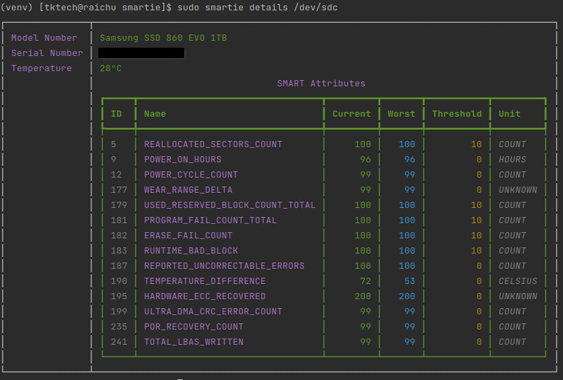
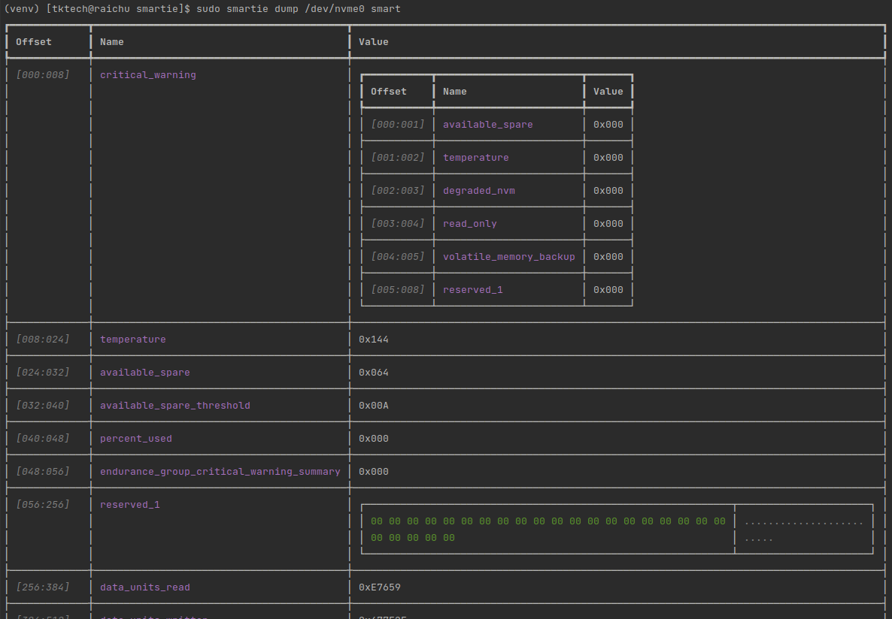

# SMARTie

This is a pure-python, 0-dependency library for getting basic disk information such as model,
serial number, disk health, temperature, and SMART data. It supports both SCSI/ATA and NVMe devices.

It provides a high-level abstraction to enumerate devices and retrieve basic
details, a low-level interface for sending raw SCSI/ATA commands, and a
command-line tool for quickly getting information about your disks.

## Usage

### API Usage

High-level usage is simple:

```python
from smartie.device import get_all_devices

for device in get_all_devices():
    # open the device first
    with device as d:
        print(d.path)
        print(d.model)
        print(d.serial)
        print(d.temperature)

        for attribute in d.smart_table.values():
            print(attribute.name, attribute.current_value)
```

Drop down a level if you want and send raw SCSI commands, such as an `INQUIRY`:

```python
import ctypes

from smartie.scsi import structures
from smartie.device import get_device

with get_device('\\.\PhysicalDrive0') as device:
    # The structure that will be populated with the response.
    inquiry = structures.InquiryResponse()
  
    sense = device.issue_command(
        structures.Direction.FROM,
        structures.InquiryCommand(
            operation_code=structures.OperationCode.INQUIRY,
            allocation_length=ctypes.sizeof(inquiry)
        ),
        inquiry
    )
  
    print(inquiry.product_identification)
```

Or send an NVME `IDENTIFY` command:

```python
import ctypes

from smartie.nvme import structures
from smartie.device import get_device

with get_device('/dev/nvme0') as device:
    # The structure that will be populated with the response.
    data = structures.NVMEIdentifyResponse()
    device.issue_admin_command(
        structures.NVMEAdminCommand(
            opcode=structures.NVMEAdminCommands.IDENTIFY,
            addr=ctypes.addressof(data),
            data_len=ctypes.sizeof(data),
            cdw10=1
        )
    )
    print(data.model_number)
```

### Command Line Usage

Want to get JSON output to use with other programs? Use the command-line tools under
`smartie api`, such as `list` to enumerate devices:

```
> sudo smartie api list
[
    {
        "model": "WD_BLACK SN770 2TB",
        "path": "/dev/nvme0n1",
        "serial": "<redacted>",
        "temperature": 52
    },
    {
        "model": "Samsung SSD 860 EVO 1TB",
        "path": "/dev/sdb",
        "serial": "<redacted>",
        "temperature": 27
    },
    {
        "model": "Samsung SSD 860 EVO 1TB",
        "path": "/dev/sdc",
        "serial": "<redacted>",
        "temperature": 28
    },
    {
        "model": "WD_BLACK SN770 2TB",
        "path": "/dev/nvme1n1",
        "serial": "<redacted>",
        "temperature": 46
    },
    {
        "model": "Samsung SSD 860 EVO 1TB",
        "path": "/dev/sda",
        "serial": "<redacted>",
        "temperature": 26
    }
]
```

Are you a human and just want to see your disk details? Take a look at
`smartie enumerate` and `smartie details`:



How about a developer trying to build a tool? You can use `smartie dump` to get
access to raw responses from the disk as a table or binary:



## Support

| OS      | SCSI/ATA Supported | NVME Supported | Notes                                      |
|---------|--------------------|----------------|--------------------------------------------|
| Linux   | Yes                | Yes            | SG_IO v3 (Linux 2.6+)                      |
| Windows | Yes                | In-progress    |                                            |
| OS X    | In-progress*       | N/A            | *IDENTITY and SMART-related commands only. |

OS X explicitly denies access to SCSI/ATA pass-through, _except_ for IDENTITY
and some SMART-related commands, so this is all we can support. Work for OS X
is currently in-progress.

| RAID/HBA Adapter   | OS under test| SCSI Supported | ATA Supported |
|--------------------|--------------|----------------|---------------|
| Broadcom RAID 9440 | CentOS 8.4   | Yes            | Yes           |
| Broadcom RAID 9560 | CentOS 8.4   | Yes            | Yes           |
| Broadcom HBA  9500 | CentOS 8.4   | Yes            | Yes           |
| ThinkSystem   930  | CentOS 8.4   | Yes            | Yes           |
| ThinkSystem   940  | CentOS 8.4   | Yes            | Yes           |
| ThinkSystem   4350 | CentOS 8.4   | Yes            | Yes           |
| ThinkSystem   5350 | CentOS 8.4   | Yes            | Yes           |

Only inquiry, identify and smart commands are tested, and the tests use the latest driver from 
vendor support web. If it does not work in your environment, open an [issue][].

## Installation
SMARTie currently requires Python 3.8 or greater.

```
pip install smartie
```

If you want the command line tools, you'll also want to do:

```
pip install smartie[cli]
```

## FAQ

### This library isn't returning any of my drives?

The APIs this library uses to communicate with devices typically require
root (on Linux) or administrator (on Windows) access to work.

### My drive doesn't work with this library?

Support for drives that don't follow modern standards is still a work in
progress. Open an [issue][].

### Library Y does X, can I copy that code?

**It depends.** This library is available under the MIT license and is a fun side
project. I want anyone to be able to use it. Many existing projects are GPL or
LGPL, so you need to avoid them when contributing to this project. Instead:

- Use the specifications or vendor documentation whenever possible.
- Use the SG_IO documentation by Danny (https://sg.danny.cz/sg/).
- Use the _conversations_ in mailing lists and bug trackers, while avoiding the
  code.

### Does this library support RAID controllers?

Untested. It hasn't been thoroughly tested with RAID controllers, as the target audience
for the main program that uses this library is consumer desktops. Patches happily
accepted if you have one to test with!


### ATA, ATAPI, SCSI, NVMe, what?

Acronyms, acronyms everywhere! What does any of this mean?

- [ATA]: Advanced Technology Attachment.
- [ATAPI]: AT Attachment Packet Interface.
- [SCSI]: Small Computer System Interface. 
- [NVMe]: Non-Volatile Memory Express. The standard for connecting "modern" solid-state
  drives to a computer, typically through [PCI-e].
- [SATA]: Serial ATA. 
- [PATA]: Parallel ATA.
- [S.M.A.R.T]: Self-Monitoring, Analysis, and Reporting Technology. A standard for
  hard drives and solid-state drives to report their health and status.

[ATA]: https://en.wikipedia.org/wiki/ATA
[ATAPI]: https://en.wikipedia.org/wiki/ATAPI
[SCSI]: https://en.wikipedia.org/wiki/SCSI
[NVMe]: https://en.wikipedia.org/wiki/NVMe
[PCI-e]: https://en.wikipedia.org/wiki/PCI_Express
[SATA]: https://en.wikipedia.org/wiki/SATA
[PATA]: https://en.wikipedia.org/wiki/Parallel_ATA
[S.M.A.R.T]: https://en.wikipedia.org/wiki/S.M.A.R.T.
[phm]: https://github.com/TkTech/PortableHardwareMonitor
[issue]: https://github.com/TkTech/smartie/issues/new.